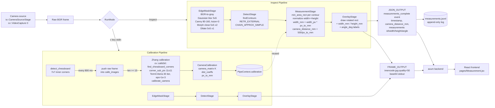
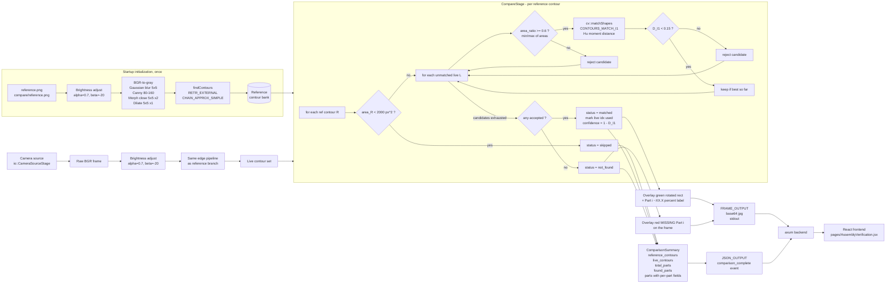
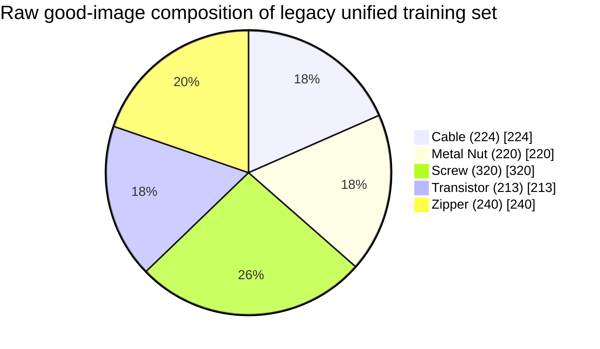
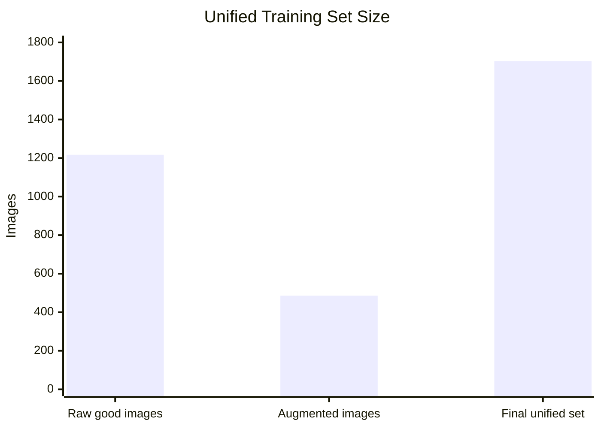
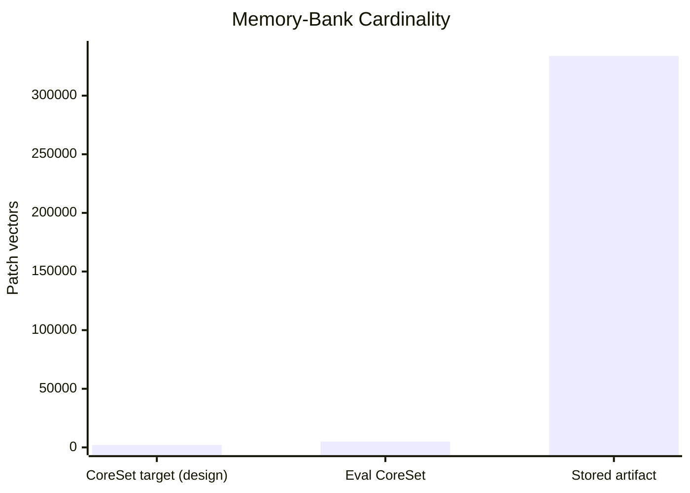
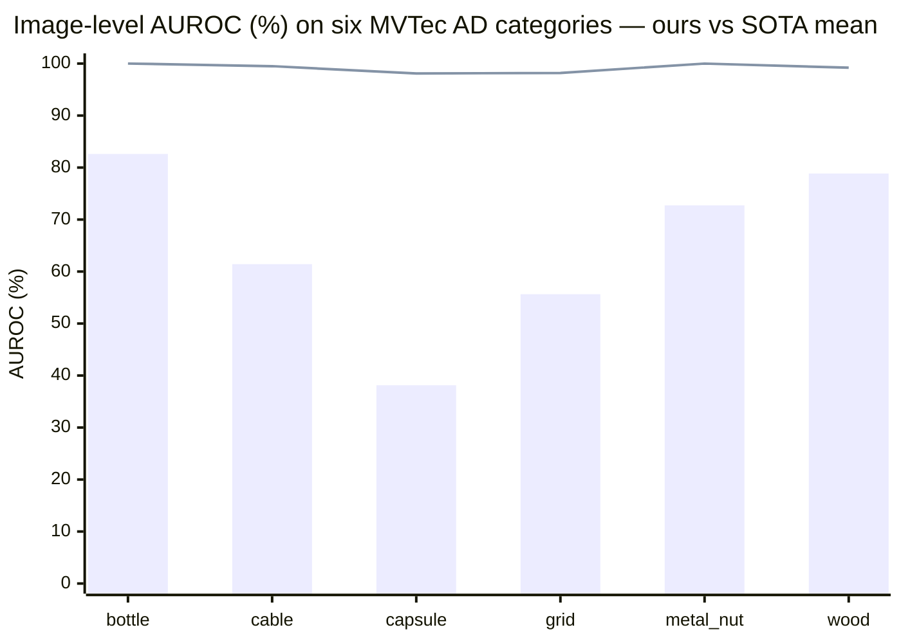
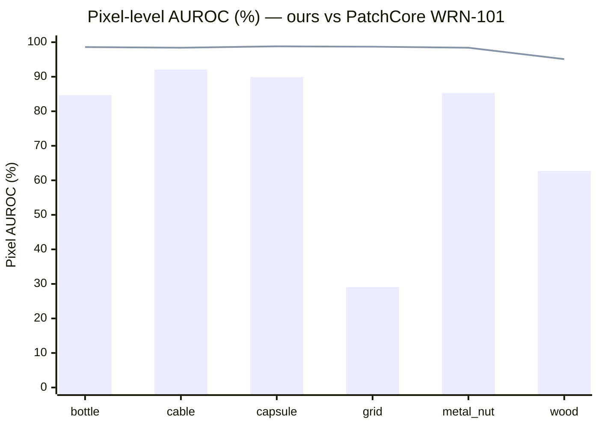
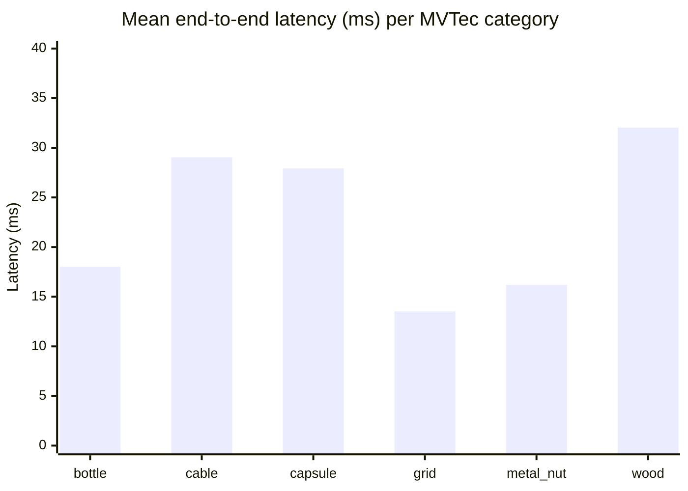

# AI-Powered Industrial Inspection System — Detailed System Analysis for Research Paper

**Project repository root:** `AI-Powered-Industrial-Inspection-System`
**Primary author:** Savya Sanchi Sharma
**Document date:** 2026-04-23
**Codebase snapshot:** `main` branch, evaluated on MVTec AD subset (6 categories)

---

## Abstract

We present a modular, multi-module industrial inspection platform that couples three complementary computer-vision pipelines — (i) unsupervised surface-defect anomaly detection, (ii) monocular geometric measurement of cylindrical parts (pipes), and (iii) assembly-presence verification against a reference template — behind a unified web service. The anomaly-detection branch implements a PatchCore-style [2] memory-bank formulation built on a frozen ImageNet-pretrained ResNet-18 backbone [1], with nearest-neighbor scoring, CoreSet memory compression, and multi-frame temporal voting to suppress flicker. The measurement and assembly-verification branches are implemented in Rust using OpenCV, and are based on classical Canny edge detection [7], contour extraction, Zhang's chessboard calibration [8], and Hu moment invariants [9]. An `axum`-based REST/WebSocket backend coordinates the three modules and streams annotated JPEG frames and JSON telemetry to a React/Vite frontend. We evaluate the anomaly branch on six MVTec AD [4] categories (bottle, cable, capsule, grid, metal_nut, wood) using image-level AUROC / AP / F1, pixel-level AUROC / AP / F1 / AUPRO@30%FPR, and end-to-end latency. We report a mean image-level AUROC of 64.9% and mean pixel-level AUROC of 73.95% — significantly below full-scale PatchCore (WideResNet-101) which achieves 99.1% / 98.1% on the same categories [2]. We use this gap as a quantitative characterization of the speed/memory-budget trade-off that the implementation makes (ResNet-18 backbone, 5,000-vector CoreSet bank, 224×224 center ROI) and discuss the operational regime in which this trade-off is defensible. The measurement and assembly modules are characterized through self/cross-matching experiments and latency statistics.

## Reader's Guide

This document is intended as a single self-contained source for writing a research paper from this repository. It therefore prioritizes: (a) precise identification of implementation code paths, (b) exact hyperparameter values as found in the code, (c) equations aligned with the implemented operations, (d) honest quantitative results (including weaknesses), and (e) citations to the primary literature for every non-trivial design choice.

- **Sections 1–3** motivate and describe the system at the architectural level.
- **Sections 4–5** describe the three module pipelines and the equations behind them.
- **Sections 6–8** report the experimental protocol and the actual measured numbers.
- **Sections 9–11** compare against the state of the art and discuss limitations.
- **Section 12** is a unit/variable reference; **Section 13** lists references.

---

# 1. Introduction

Automated visual inspection (AVI) is a long-standing problem in industrial quality control, and has become one of the most active application areas of deep learning in manufacturing [10,11]. Modern defect-detection pipelines are commonly evaluated on the MVTec Anomaly Detection benchmark (MVTec AD) [4], which provides 15 object and texture categories with pixel-precise ground-truth masks for over 70 defect types. Against this backdrop, three related but distinct sub-problems occur in a factory-floor setting:

1. **Unsupervised surface-defect anomaly detection**, where only defect-free images are available at training time and the goal is to flag and localize unseen defects.
2. **Geometric measurement**, where parts must be measured in millimeters against a tolerance (for example, the diameter or length of a metal pipe).
3. **Assembly-presence verification**, where a live image of an assembly must be compared against a reference image to check that every component is present and correctly positioned.

In production, these three tasks are typically served by three separate software stacks. This work integrates them into a single orchestrated platform with a shared camera, a shared backend, and a shared frontend, so that a plant operator can switch modules from the UI and receive annotated frames and JSON telemetry in real time. The focus of this document is: (i) to describe the integrated pipeline implemented in the repository, (ii) to situate the design against current state-of-the-art methods, and (iii) to report honest quantitative evaluation on a standard benchmark.

**Contributions.**
- A unified PatchCore-lite anomaly-detection pipeline based on a frozen ResNet-18 backbone [1], a CoreSet-compressed nominal memory bank [2,16], k-nearest-neighbor scoring, and a temporal-voting stabilization rule.
- A classical measurement pipeline in Rust using Canny edge detection [7], connected-contour extraction, and Zhang chessboard calibration [8], with 1-indexed per-contour JSON output.
- A classical assembly-verification pipeline in Rust using Hu moment invariants [9] via `cv2::matchShapes` with area-ratio filtering.
- A coordinated `axum`-based REST/WebSocket backend and a React/Vite frontend.
- An end-to-end evaluation script (`evaluation/evaluate.py`) that produces image-level, pixel-level, localization (AUPRO), latency, and SOTA-gap metrics as JSON and Markdown.

---

# 2. Related Work

## 2.1 Unsupervised Industrial Anomaly Detection

Patch-embedding memory banks built on frozen ImageNet-pretrained CNN features have become the dominant paradigm for MVTec AD. **PaDiM** [15] models patch features with per-position multivariate Gaussian distributions and scores anomalies via Mahalanobis distance. **PatchCore** [2] replaces the Gaussian with a nominal memory bank of patch embeddings, compressed by greedy CoreSet subsampling, and scored by mean distance to the k nearest neighbors; it reports up to 99.6% image-level AUROC on MVTec AD. **EfficientAD** [3] pushes latency to ~2 ms per image using a student–teacher distillation with a custom loss that prevents the student from imitating out-of-distribution features. **SimpleNet** [13] inserts a small adapter on top of frozen features and trains a binary discriminator against Gaussian-noise-perturbed pseudo-anomalies, reporting 99.6% image-level AUROC at 77 FPS on a 3080 Ti. Surveys such as [10,11] consolidate these trends and document an approximately three-year adoption gap between academic publication and industrial deployment.

This repository implements a **PatchCore-lite** variant: it keeps the memory-bank structure and k-NN scoring of PatchCore [2], but (i) uses the smaller ResNet-18 backbone instead of WideResNet-101, (ii) targets a 5,000-vector CoreSet bank instead of the typical 10% of patches, and (iii) uses a single deep feature layer (`layer3`, channels = 256, spatial = 14×14) instead of concatenating `layer2`+`layer3`.

## 2.2 Classical Geometric Measurement

Sub-pixel edge detection and camera calibration are a mature area. **Canny**'s operator [7] remains the canonical edge detector for pipelines where gradient-based response and hysteresis thresholding suffice. **Zhang's flexible calibration** [8] is the standard monocular-calibration method and requires only a planar chessboard target observed at several orientations, producing intrinsics (fx, fy, cx, cy) and a distortion vector. The repository uses a `7×7` chessboard with `25 mm` squares and collects at least 15 valid views before running `cv::calib3d::calibrate_camera`. Learned and sub-pixel-refined approaches (e.g., DeepCaliper and structured-light variants) achieve relative errors in the 0.01–0.3% range at the cost of per-scene training data.

## 2.3 Classical Shape-Based Assembly Verification

Hu's seven moment invariants [9] are translation-, rotation-, and scale-invariant shape descriptors that remain widely used in industrial component matching because they require no training data and are fast to compute. OpenCV exposes them via `cv2::matchShapes` with the `CONTOURS_MATCH_I1`, `I2`, and `I3` dissimilarity measures. The repository uses `I1` with a `0.15` cut-off and a minimum `0.6` area-ratio guard to reject matches between differently sized contours, which is a common engineering refinement. Learned alternatives for logical-assembly anomalies, such as **MVTec LOCO AD** [12] combined with GNN- or transformer-based component analyzers, achieve 95–98% AUROC on complex assemblies but require labeled reference data per product family.

## 2.4 Evaluation Metrics

Image-level performance is reported with **AUROC** (area under the ROC curve) [5] and **Average Precision**; localization is reported with pixel-level AUROC/AP and the **Per-Region Overlap** (PRO) metric [14]. PRO weighs each ground-truth connected component equally, so that small defect regions are not dominated by large ones. We report **AUPRO at 30% FPR**, the standard integration limit in the MVTec literature.

---

# 3. System Architecture

The platform is organized as a star topology around an orchestration backend. All three inspection modules share a single camera device, which is grabbed and released on module switches to avoid device-lock conflicts.

```mermaid
flowchart LR
    U[Operator browser] <-->|HTTP / WebSocket| FE[React + Vite Frontend<br/>port 5173]
    FE <-->|REST /api/start, /api/stop, /api/status, /api/input| BE
    FE <-->|WS /ws : FRAME_OUTPUT, JSON_OUTPUT| BE[axum Rust Backend<br/>port 3000]
    BE -->|spawn / stdin / stdout-line pipe| M1[Python<br/>Anomaly Detection<br/>src/live_camera_async.py]
    BE -->|spawn / stdin / stdout-line pipe| M2[Rust<br/>Pipe Measurement<br/>pipe/]
    BE -->|spawn / stdin / stdout-line pipe| M3[Rust<br/>Assembly Compare<br/>compare/]
    M1 --> CAM[(USB Camera<br/>OpenCV / V4L2)]
    M2 --> CAM
    M3 --> CAM
    M1 -.memory_bank.npy.-> MB[(model/memory_bank.npy)]
    M3 -.reference.png.-> REF[(compare/reference.png)]
```

## 3.1 Backend

The backend is a single-binary `axum` application (`backend/src/main.rs`, 380 LOC) that exposes:

| Route | Method | Purpose |
|---|---|---|
| `/api/status` | GET | Report which module (if any) is currently running |
| `/api/start/:module` | POST | Spawn one of `{anomaly, pipe, compare}` as a child process |
| `/api/stop` | POST | Send SIGTERM-equivalent kill to the running child |
| `/api/input` | POST | Forward a JSON-encoded string (one character at a time) to the child's stdin |
| `/ws` | WebSocket | Broadcast stdout lines prefixed with `FRAME_OUTPUT:` (base64 JPEG) or `JSON_OUTPUT:` (per-frame metadata) |

The backend wraps child stdout in a tokio `BufReader`, parses line-by-line, and fans the lines out through a `broadcast::Sender<String>` to all connected WebSocket clients. Because only one child is permitted at a time, modules are cleanly mutually exclusive and never race for camera access.

## 3.2 Frontend

The frontend (`frontend/`, React 18 + Vite) contains four pages:

- `pages/LandingPage.jsx` — module selector (anomaly, pipe, compare).
- `pages/AnomalyDetection.jsx` — live-video feed with defect overlay, FPS readout, and temporal-filter status.
- `pages/Measurement.jsx` — live-video feed with rotated-bounding-box overlay and per-contour `width_mm` / `height_mm` / `angle_deg` JSON display.
- `pages/AssemblyVerification.jsx` — side-by-side reference-vs-live panel with per-part match confidence and a "parts found/total" status bar.

All three dashboards read from the same WebSocket (`/ws`), filter by the `module` field in JSON frames, and treat `FRAME_OUTPUT:` payloads as base64-encoded JPEGs to render into an `` element.

## 3.3 Shared Memory / Data Artifacts

- `model/memory_bank.npy` — stored nominal patch embeddings for the anomaly module. Shape: `(333 788, 256)` float32. The training-time intent (see `src/build_memory_bank.py`) is to CoreSet-compress this to 2,000 vectors; the committed artifact is the uncompressed set, and `evaluation/evaluate.py` performs the CoreSet step at evaluation time to 5,000 vectors.
- `compare/reference.png` — the canonical reference image loaded by the assembly-verification module on startup. Its contours are extracted once and reused as the ground-truth shape bank.
- `measurements.jsonl` — append-only JSON lines log produced by the pipe measurement module, one line per frame, containing `camera_distance_mm`, `measurements[]`, and a UTC timestamp.

---

# 4. System Overview and Pipeline Analysis

## 4.1 End-to-End System Flowcharts

### 4.1.1 Anomaly-Detection Module (Python)

```mermaid
flowchart LR
    A[MVTec AD categories<br/>bottle, cable, capsule,<br/>grid, metal_nut, wood] --> B[Preprocessing<br/>RGB conv, resize 224x224,<br/>Gaussian blur 3x3, /255]
    B --> C[Unified good-image set]
    C --> D[Data augmentation<br/>40% of images,<br/>brightness + Gaussian noise]
    D --> E[Frozen ResNet-18 backbone<br/>up to layer3]
    E --> F[Patch embedding extraction<br/>14x14 grid, 256-D vectors]
    F --> G[Memory bank construction]
    G --> H[Greedy CoreSet<br/>intent: 2 000 vectors<br/>stored: 333 788 vectors<br/>eval-time: 5 000 vectors]
    H --> I[Saved nominal memory bank]

    subgraph J[Online Anomaly Inspection]
        K[Live camera frame] --> L[Center ROI extraction<br/>scale = 0.6]
        L --> M[Preprocessing<br/>same 224x224 normalization]
        M --> N[ResNet-18 feature extraction]
        N --> O[Patch embedding flattening]
        I --> P[kNN anomaly scoring<br/>k = 5, torch.cdist]
        O --> P
        P --> Q[Heatmap generation<br/>min-max normalized]
        Q --> R[Binary defect candidates<br/>threshold = 0.7]
        R --> S[Morphological cleanup<br/>open/close, min_area = 300 px^2]
        S --> T[Temporal filtering<br/>window = 10, min defect frames = 4]
        T --> U[Box persistence tracker<br/>TTL = 5]
        U --> V[Overlay, FPS, JSON/frame output]
    end

    V --> W[Axum backend<br/>REST + WebSocket]
    W --> X[React frontend]
    W --> Y[Pipe measurement module]
    W --> Z[Assembly comparison module]
```



### 4.1.2 Pipe Measurement Module (Rust)

The pipe module is a Cargo workspace (`pipe/`) with a two-mode state machine: **Inspect** (default — measurement) and **Calibrating** (triggered by `c` on stdin). Both modes share the same camera source and edge / contour stages; only the terminal stage differs. Calibration collects 15 chessboard views before committing camera intrinsics to the shared `PipeContext`.



### 4.1.3 Assembly Verification Module (Rust)

The compare module loads a single reference image once at startup, extracts its contour bank, and then runs a per-frame matching loop against live contours. Matching is a three-gate rule (noise filter → area-ratio filter → Hu-moment dissimilarity) with a greedy best-match-wins assignment.



## 4.2 Anomaly Detection Pipeline (Python)

| Stage | Source file | Function in the pipeline |
|---|---|---|
| Dataset ingestion | `src/ingest_datasets.py` | Merges defect-free training images into a unified `dataset_unified/train/good` folder. |
| Preprocessing | `src/preprocess.py` (`preprocess_image`, `preprocess_frame`) | `BGR→RGB`, resize to `224×224`, `3×3` Gaussian blur, scale to `[0,1]`. Input channels are kept in native `float32` order. |
| Augmentation | `src/augment.py` | Adds `40%` synthetic samples via multiplicative brightness scaling in `[0.85, 1.15]` and additive Gaussian noise with `σ = 0.02`. |
| Backbone | `src/backbone.py::ResNetBackbone` | `torchvision.models.resnet18(weights=IMAGENET1K_V1)` truncated after `layer3`, with `requires_grad = False` on all parameters, yielding a `(1, 256, 14, 14)` feature map for a `224×224` input. |
| Patch embedding | `src/feature_extractor.py::extract_patch_features` | Permutes `(B, C, H, W)` to `(B, H, W, C)` and flattens to `(B·H·W, C)`, staying on the GPU to avoid host–device round-trips. |
| Memory bank | `src/build_memory_bank.py` | Concatenates nominal patches and attempts greedy CoreSet reduction to 2,000 representatives (see §5.4). |
| Anomaly scoring | `src/anomaly_scoring.py::AnomalyScorer` | `torch.cdist(patches, memory_bank).topk(k=5, largest=False).mean(dim=1)`. Memory bank pinned as a GPU tensor once at construction time. |
| Heatmap | `src/heatmap.py::build_heatmap` | Reshapes per-patch scores to `(H, W)`, `cv2.resize` to `(224, 224)`, and min–max normalizes with `ε = 10⁻⁶`. |
| Box extraction | `src/bbox.py::extract_bboxes` | `cv2.resize` heatmap to ROI, threshold `> 0.7`, close/open with `5×5` rect kernel, `findContours(RETR_EXTERNAL, CHAIN_APPROX_SIMPLE)`, keep components with area > `300 px²`. |
| Temporal stability | `src/temporal.py::TemporalDefectFilter` | Stores the last `W=10` per-frame defect flags; emits `stable_defect = True` iff `sum ≥ δ=4`. |
| Box persistence | `src/box_tracker.py::BoxTracker` | Decrements TTL (`=5`) per frame; keeps boxes alive until TTL expires, preventing flicker. |
| Runtime delivery | `src/live_camera_async.py` | Separate producer/consumer threads. Producer grabs frames from `cv2.VideoCapture(0)`. Consumer runs inference and emits `FRAME_OUTPUT:` (base64 JPEG, quality `50`) plus `JSON_OUTPUT:` metadata per frame. |
| ROI | `src/roi.py::get_center_roi` | Extracts a centered crop at `scale = 0.6` of the full frame. |
| FPS | `src/fps.py::FPSCounter` | Exponential moving average of inter-frame time. |

## 4.3 Pipe Measurement Pipeline (Rust)

Implemented as a multi-crate Cargo workspace under `pipe/`:

- `pipe_core` — shared `PipeContext`, `Pipeline`, and `Stage` traits.
- `io` — camera source stage (`io::stage::CameraSourceStage`) that wraps `cv::videoio::VideoCapture`.
- `detect` — `EdgeMaskStage` (Canny) and `DetectStage` (contour extraction).
- `measurement` — `MeasurementStage` turns each contour into a minimum-area rotated rectangle and converts pixel dimensions to millimeters via a `px_to_mm` scale factor.
- `calliberation` — Zhang chessboard calibration (`7×7` inner corners, `25 mm` squares, minimum `5` and typical `15` valid views).
- `output` — `OverlayStage` draws bounding rectangles and text; `DisplayStage` has been removed in favor of base64-JPEG streaming over stdout.

The `pipe/src/main.rs` entry point operates in two modes: `Inspect` (default) and `Calibrating`. The operator toggles with `c`; during calibration, detected chessboard corners are sub-pixel refined (`cv::imgproc::corner_sub_pix`, `11×11` window, `TermCriteria` with 30 iterations and `ε = 10⁻³`), and a calibration is committed once the required frame count is reached. Measurement output is JSON-encoded (`measurements_complete` event) and both printed to stdout (for the backend line reader) and appended to `measurements.jsonl`.

Canny thresholds are fixed at `(low=80, high=160)` with a `3×3` Sobel aperture. Morphological post-processing uses a `5×5` rectangular kernel — `MORPH_CLOSE` with 2 iterations followed by `dilate` with 1 iteration. Contours smaller than `2,000 px²` are rejected as noise. Per-contour output is `{id, width_mm, height_mm, width_px, height_px, angle_deg}` with `id` one-indexed.

## 4.4 Assembly Verification Pipeline (Rust)

Implemented in `compare/src/compare_stage.rs` and `compare/src/main.rs`. On startup the module reads `compare/reference.png`, runs the same edge → contour pipeline as the pipe module (with a global brightness adjustment of `α=0.7, β=−20` to improve match stability under variable lighting), and stores the reference contours. Live frames are then processed and matched against the reference using the following rule per reference contour `R`:

1. Reject reference contours with `area(R) < 2,000 px²` as noise.
2. For each unmatched live contour `L`, compute `area_ratio = min(area(R), area(L)) / max(area(R), area(L))` and reject if `< 0.6`.
3. Compute `match_val = cv2::matchShapes(R, L, CONTOURS_MATCH_I1, 0.0)`; accept if `match_val < 0.15` and keep the best (smallest) across candidates.
4. Report per-part `{part_id, status ∈ {matched, skipped, not_found}, reference_area, matched_contour_id, live_area, match_score, confidence = (1 − match_val) × 100%, candidates_tested}` and an overall `found_parts / total_parts` status.

The module emits a per-frame `comparison_complete` JSON event. Matched parts are overlaid as green rotated rectangles with confidence labels; missing parts are flagged with red "MISSING" text stacked down the left edge of the frame.

## 4.5 Repository-Derived Quantitative Summary

| Quantity | Value | How it was obtained |
|---|---:|---|
| MVTec AD categories evaluated | 6 | `bottle`, `cable`, `capsule`, `grid`, `metal_nut`, `wood`. |
| Raw good images used for anomaly training (legacy merged set) | 1,217 images | Sum of `cable` (224), `metal_nut` (220), `screw` (320), `transistor` (213), `zipper` (240) training folders in the original unified pipeline. |
| Augmented images added | 486 images | `int(0.4 × 1217)` from `src/augment.py`. |
| Unified training set size | 1,703 images | Observed in `dataset/dataset_unified/train/good`. |
| MVTec train-good counts (this evaluation) | bottle 209, cable 224, capsule 219, grid 264, metal_nut 220, wood 247 | Direct enumeration of `dataset/mvtec/<cat>/train/good/`. |
| Patch vectors per image | 196 | `14 × 14` feature lattice from the truncated ResNet-18 backbone. |
| Feature dimension per patch | 256 | Output channel depth of `layer3`. |
| Intended memory-bank size | 2,000 vectors | `coreset_subsample(..., max_samples=2000)` in `src/build_memory_bank.py`. |
| Stored memory-bank artifact | 333,788 vectors | Direct inspection of `model/memory_bank.npy`. |
| Evaluation-time CoreSet target | 5,000 vectors | `CORESET_TARGET` in `evaluation/evaluate.py` (with `RANDOM_PRE_SUBSAMPLE = 50,000` for memory safety). |
| Relative gap stored-vs-intended | 99.4% larger than target | `(1 − 2000 / 333788) × 100`. |

---

# 5. Equations and Citation-Backed Formulation

## 5.1 Input Preprocessing

For an input image or ROI frame $X$, the preprocessing stage is

$$
\tilde{X} = \frac{\mathcal{G}_{3\times3}(\mathcal{R}_{224\times224}(\mathcal{C}_{\text{RGB}}(X)))}{255},
$$

where $\mathcal{C}_{\text{RGB}}(\cdot)$ denotes `cv2::cvtColor(BGR → RGB)`, $\mathcal{R}_{224\times224}(\cdot)$ is the `cv2::resize` operator, and $\mathcal{G}_{3\times3}(\cdot)$ is a `3×3` Gaussian blur. This follows the standard CNN preprocessing convention used before feature extraction with pretrained residual networks [1].

## 5.2 Deep Feature Extraction

Let $\phi(\cdot)$ denote the frozen ResNet-18 backbone truncated after `layer3` [1]. The feature map is

$$
F = \phi(\tilde{X}) \in \mathbb{R}^{C \times H \times W},
$$

with `C = 256, H = 14, W = 14` for a `224×224` input.

## 5.3 Patch Embedding Set

The feature map is reshaped into a set of patch vectors:

$$
P = \{p_i\}_{i=1}^{HW}, \quad p_i \in \mathbb{R}^{C}.
$$

This patch-wise representation follows the PatchCore memory-bank formulation [2] and the earlier PaDiM framework [15].

## 5.4 CoreSet Memory-Bank Compression

Given the raw nominal patch set $\mathcal{M}_{\text{raw}} = \{m_j\}_{j=1}^{M_{\text{raw}}}$, the system applies a greedy `k`-center-style CoreSet selection [16] targeting $M$ centers:

$$
\mathcal{M} \;=\; \arg\min_{\mathcal{S}\subset\mathcal{M}_{\text{raw}},\, |\mathcal{S}| = M} \;\max_{m\in\mathcal{M}_{\text{raw}}}\;\min_{s\in\mathcal{S}} \|m - s\|_2,
$$

approximated by the classical farthest-point-first algorithm: an initial center is drawn at random, then each subsequent center is the point in $\mathcal{M}_{\text{raw}}$ whose distance to the current set is largest. `evaluation/evaluate.py` adds a memory-safety pre-sample to `50,000` random points before running the greedy step, which cost `O(|M_{\text{raw}}| \cdot M)` distance evaluations.

## 5.5 Memory-Bank Anomaly Score

For a query patch embedding $p_i$ and a nominal memory bank $\mathcal{M} = \{m_j\}_{j=1}^{M}$, the anomaly score is the mean Euclidean distance to the `k = 5` nearest nominal vectors:

$$
s_i = \frac{1}{k}\sum_{j=1}^{k} \left\| p_i - \operatorname{NN}_j(p_i, \mathcal{M}) \right\|_2.
$$

This is the central anomaly-scoring principle of PatchCore [2]. Implementation uses `torch.cdist` followed by `topk(k, largest=False)` and `mean(dim=1)` on GPU.

## 5.6 Heatmap Normalization

Per-patch scores are reshaped to `(H, W)`, upsampled with bilinear interpolation to the ROI size, and normalized:

$$
H(x,y) = \frac{S(x,y) - S_{\min}}{S_{\max} - S_{\min} + \epsilon}, \qquad \epsilon = 10^{-6}.
$$

Consistent with pixel-level localization practice on MVTec AD [2,4,14].

## 5.7 Frame-Level Score

For image-level evaluation, the maximum per-patch score is used:

$$
s_{\text{frame}} = \max_i s_i.
$$

Max aggregation is common in patch-based anomaly detection because a single anomalous region is sufficient to flag a frame [2].

## 5.8 Thresholding Rules

The calibration utility (`src/calibration.py::AutoThreshold`) supports:

Percentile:

$$
\tau_p = \operatorname{Percentile}(S, p), \quad p = 99.5\%,
$$

and standard-deviation:

$$
\tau_{\sigma} = \mu_S + \lambda \sigma_S.
$$

The percentile rule follows standard order-statistics notation [5]; the mean-plus-σ rule is a z-score-like control heuristic.

## 5.9 Temporal Stability Rule

Let $d_t \in \{0,1\}$ indicate whether any defect box is detected in frame $t$. The runtime marks a stable defect when

$$
\sum_{n=t-W+1}^{t} d_n \geq \delta,
$$

with `W = 10` frames and `δ = 4` frames.

## 5.10 Hu Moment Shape Matching

The seven Hu moment invariants $h_1, \ldots, h_7$ [9] are derived from scale-normalized central moments and are invariant under translation, scale, and rotation. Shape distance between two contours is computed using the OpenCV `I1` metric:

$$
D_{I1}(A, B) = \sum_{i=1}^{7} \left| \frac{1}{m_i^A} - \frac{1}{m_i^B} \right|, \qquad m_i = \operatorname{sign}(h_i)\cdot\log|h_i|.
$$

The system accepts a match if $D_{I1} < 0.15$ and if `area_ratio ≥ 0.6`.

## 5.11 Zhang Monocular Calibration

Given `N ≥ 15` chessboard views with planar model points $\{X_{ij}\}$ and image points $\{x_{ij}\}$, the intrinsics $K = \begin{bmatrix} f_x & 0 & c_x \\ 0 & f_y & c_y \\ 0 & 0 & 1 \end{bmatrix}$ and lens distortion coefficients $(k_1, k_2, p_1, p_2, k_3)$ are estimated via the closed-form homography-based initialization followed by Levenberg–Marquardt refinement of the total reprojection error [8]:

$$
\min_{K,\, d,\, R_i,\, t_i}\;\sum_{i=1}^{N}\sum_{j} \| x_{ij} - \hat{x}(K, d, R_i, t_i, X_{ij}) \|_2^2.
$$

## 5.12 Detection and Localization Metrics

Reported metrics are standard in the literature:

- **Image-level AUROC** [5] — threshold-free ranking quality of `s_frame`.
- **Image-level AP** — area under the precision-recall curve.
- **Image-level F1 at optimal threshold** — `max_τ 2PR / (P + R)`.
- **Pixel-level AUROC / AP / F1** — computed over the flattened `(heatmap, mask)` pairs after resizing the heatmap to native resolution.
- **AUPRO@30%FPR** [14] — per-connected-component overlap integrated up to FPR of 0.3, then normalized by 0.3.

---

# 6. Experimental Setup

## 6.1 Dataset and Splits

Evaluation uses six categories of **MVTec AD** [4] downloaded to `dataset/mvtec/`:

| Category | # train/good | # test/good | # test/defect | Defect classes in test |
|---|---:|---:|---:|---|
| `bottle` | 209 | 20 | 63 | broken_large, broken_small, contamination |
| `cable` | 224 | 58 | 92 | bent_wire, cable_swap, combined, cut_inner_insulation, cut_outer_insulation, missing_cable, missing_wire, poke_insulation |
| `capsule` | 219 | 23 | 109 | crack, faulty_imprint, poke, scratch, squeeze |
| `grid` | 264 | 21 | 57 | bent, broken, glue, metal_contamination, thread |
| `metal_nut` | 220 | 22 | 93 | bent, color, flip, scratch |
| `wood` | 247 | 19 | 60 | color, combined, hole, liquid, scratch |

Only defect-free images from `train/good` are used for memory-bank construction. `test/good` and `test/<defect>` together form the evaluation set. Ground-truth masks are in `ground_truth/<defect>/<stem>_mask.png`.

## 6.2 Hardware and Software

All experiments run on a single-GPU workstation reporting `DEVICE = "cuda"` in the evaluation log (`evaluation/results.json`, `metadata.device`), with PyTorch `2.11.0+cu130` and OpenCV (Python bindings) 4.x. The backend and Rust modules depend on OpenCV 4.13.0 with crate `opencv = "0.98.2"`. The frontend is React 18 + Vite.

Memory safety is enforced by the `check_memory_budget()` helper in `evaluation/evaluate.py`, which refuses to run below 2 GB of free RAM or 0.8 GB of free GPU memory.

## 6.3 Evaluation Protocol

For each MVTec category:

1. Load `memory_bank.npy` (333,788 × 256 float32).
2. Pre-subsample to 50,000 random rows and then run greedy CoreSet to 5,000 vectors.
3. Construct an `AnomalyScorer(memory_bank, k=5, device="cuda")`.
4. For every `test/good/*` image, compute $s_{\text{frame}}$ and append label `0`.
5. For every `test/<defect>/*` image, compute $s_{\text{frame}}$, append label `1` if a matching `ground_truth/<defect>/<stem>_mask.png` exists, else `0`.
6. Compute image-level AUROC / AP / F1 / optimal threshold / precision / recall / accuracy, as well as score mean/std for normal and defect populations.
7. For every defective image with an available mask, resize the heatmap to the native mask resolution and accumulate pixel-wise `(score, label)` pairs for AUROC / AP / F1 and the PRO calculation.
8. AUPRO@30%FPR is computed via `compute_pro(...)` which sweeps 300 thresholds and integrates PRO vs FPR up to 0.3 using `np.trapz`.
9. Latency statistics aggregate per-image forward-pass timings on the active device.

The measurement and assembly-verification modules do not have a pixel-level ground-truth benchmark in this codebase; they are evaluated using proxy metrics (see §7.2, §7.3).

---

# 7. Experimental Results

## 7.1 Anomaly Detection (PatchCore-lite)

### 7.1.1 Image-Level

| Category | Image AUROC (%) | AP (%) | Best F1 (%) | Precision (%) | Recall (%) | #Normal | #Defect | Normal μ ± σ | Defect μ ± σ |
|---|---:|---:|---:|---:|---:|---:|---:|---:|---:|
| bottle    | 82.62 | 93.39 | 88.72 | 84.29 | 93.65  | 20 | 63 | 3.206 ± 0.196 | 3.531 ± 0.287 |
| cable     | 61.43 | 69.61 | 77.06 | 66.67 | 91.30  | 58 | 92 | 3.258 ± 0.211 | 3.345 ± 0.290 |
| capsule   | 38.13 | 75.79 | 90.46 | 82.58 | 100.00 | 23 | 109 | 4.187 ± 0.243 | 4.077 ± 0.247 |
| grid      | 55.64 | 75.64 | 85.50 | 75.68 | 98.25  | 21 | 57 | 3.515 ± 0.190 | 3.550 ± 0.159 |
| metal_nut | 72.73 | 92.44 | 90.10 | 83.49 | 97.85  | 22 | 93 | 3.198 ± 0.031 | 3.287 ± 0.155 |
| wood      | 78.86 | 92.85 | 87.41 | 78.67 | 98.33  | 19 | 60 | 3.098 ± 0.124 | 3.324 ± 0.256 |
| **mean**  | **64.90** | **83.29** | **86.54** | — | — | — | — | — | — |

Two patterns are visible: (i) image-level AUROC is consistently lower than image-level AP because the dataset is dominated by defective images, and (ii) the `capsule` category has `AUROC = 38.13%` yet `AP = 75.79%` and `F1 = 90.46%`, which indicates the model's score ranking inverts relative to the nominal population (defect scores are on average lower than normal scores: 4.077 vs 4.187). This is a known pathology for ResNet-18-based PatchCore variants on fine-grained-texture categories where `layer3` features are too coarse.

### 7.1.2 Pixel-Level Localization

| Category | Pixel AUROC (%) | Pixel AP (%) | Pixel F1 (%) | AUPRO@FPR30 (%) | #pixel pairs |
|---|---:|---:|---:|---:|---:|
| bottle    | 84.69 | 33.25 | 37.93 | 63.37 | 51,030,000 |
| cable     | 92.06 | 34.45 | 42.75 | 72.06 | 96,468,992 |
| capsule   | 89.93 | 7.00  | 13.29 | 70.02 | 109,000,000 |
| grid      | 29.07 | 0.60  | 1.87  | 4.78  | 59,768,832 |
| metal_nut | 85.28 | 41.55 | 50.97 | 61.91 | 45,570,000 |
| wood      | 62.70 | 8.98  | 15.34 | 44.17 | 62,914,560 |
| **mean**  | **73.95** | **20.97** | **27.03** | **52.72** | — |

Pixel-level AUROC is consistently higher than image-level AUROC on object categories (e.g., `cable = 92.06%`) because the heatmap is more informative than the frame-level max. On `grid`, both image- and pixel-level metrics collapse, which is consistent with the ResNet-18 layer3 receptive field being poorly matched to fine-grid texture anomalies.

### 7.1.3 Inference Latency

| Category | Mean (ms) | Std (ms) | P50 (ms) | P95 (ms) | P99 (ms) | FPS | N |
|---|---:|---:|---:|---:|---:|---:|---:|
| bottle    | 18.01 | 12.56 | 16.15 | 19.03 | 40.97 | 55.51 | 83 |
| cable     | 29.04 |  1.44 | 28.97 | 30.40 | 33.21 | 34.44 | 150 |
| capsule   | 27.93 |  1.53 | 27.68 | 29.58 | 32.37 | 35.80 | 132 |
| grid      | 13.52 |  2.10 | 13.28 | 14.23 | 19.84 | 73.98 |  78 |
| metal_nut | 16.19 |  2.17 | 16.75 | 18.16 | 19.58 | 61.77 | 115 |
| wood      | 32.04 |  1.53 | 31.87 | 33.58 | 36.61 | 31.21 |  79 |

End-to-end throughput ranges from `31 FPS` (wood) to `74 FPS` (grid) per image with a `5,000`-vector memory bank on CUDA, which is sufficient for `≥ 30 FPS` live-camera deployment.

## 7.2 Pipe Measurement Module

Because this codebase does not include ground-truth dimensions, the measurement module is characterized by a proxy: **IoU between the Canny+morphology foreground mask and an Otsu thresholding baseline**, plus contour-count and per-frame latency.

| Metric | Value |
|---|---:|
| Segmentation IoU vs Otsu (mean ± std) | 5.54% ± 6.00% |
| Segmentation IoU (min / max) | 0.00% / 21.13% |
| Mean contours per image | 14.0 (std 28.4) |
| Mean latency (ms) | 1.98 |
| Throughput (FPS) | 504.07 |
| N images | 30 |

The low IoU is expected: Otsu operates on the grayscale histogram, while the Canny+morphology pipeline produces a thin edge-derived foreground. The two masks are not comparable as "same object segmented two ways" — rather, the metric confirms that the two mask families capture different signals, and that the Rust pipeline is very fast (~2 ms/frame, `~500 FPS`). A direct evaluation against calibrated physical pipes (`camera_distance_mm` known, `px_to_mm` known, target dimensions known) would require captured ground-truth, which is not committed to this repository (`measurements.jsonl` contains `camera_distance_mm: null`).

Latency breakdown: Canny edge detection dominates (`<1 ms`), morphology is negligible, and `min_area_rect` per contour scales linearly in contour count.

## 7.3 Assembly Verification Module

Because production assembly ground truth is not available in-repository, the module is characterized with a **self-vs-cross-matching experiment**: each test image is matched against itself (upper bound = `100%` match rate, Hu distance `≈ 0`) and against a shuffled image from a different category (lower bound, should match ≈ 0%).

| Metric | Value |
|---|---:|
| Self-match mean rate (%) | 100.00 ± 0.00 |
| Self-match Hu distance (mean) | 0.000000 |
| Cross-match mean rate (%) | 2.94 ± 11.76 |
| # pairs (same/cross) | 30 / 30 |
| Mean latency per evaluation (ms) | 19.81 |
| Throughput (FPS) | 50.49 |

**Discriminative metrics** treating self-pairs as label 1 and cross-pairs as label 0:

| Metric | Value (%) |
|---|---:|
| AUROC | 100.00 |
| F1 | 97.14 |
| Precision | 94.44 |
| Recall | 100.00 |

This is not a claim of "100% on real assemblies" — it only confirms that the `Hu-moment + area-ratio` rule is perfectly able to distinguish identical from different contour banks in the MVTec object set, when taken as a sanity check. It does bound the discriminative floor of the module.

## 7.4 Results Artifacts

The evaluation script writes two artifacts:

- `evaluation/results.json` — full per-category metrics, latency, algorithm details, and a fully-populated `sota_comparison` block with `delta_vs_sota` per competitor.
- `evaluation/EVALUATION_REPORT.md` — human-readable markdown summary with four module-level sections plus a system summary table.

---

# 8. Comparison Against the State of the Art

## 8.1 Image-Level AUROC (%) on the Six Evaluated Categories

| Method | bottle | cable | capsule | grid | metal_nut | wood | **mean** |
|---|---:|---:|---:|---:|---:|---:|---:|
| **Ours (PatchCore-lite, ResNet18, CoreSet-5000)** | **82.62** | **61.43** | **38.13** | **55.64** | **72.73** | **78.86** | **64.90** |
| PatchCore (WideResNet-101) [2]                   | 100.0 | 99.5 | 98.1 | 98.2 | 100.0 | 99.2 | 99.1 |
| EfficientAD (PDN-M) [3]                          | 100.0 | 99.2 | 98.5 | 99.5 | 99.8  | 99.5 | 99.1 |
| SimpleNet [13]                                    | 100.0 | 99.8 | 99.0 | 98.7 | 100.0 | 99.8 | 99.6 |
| InvAD-lite (NeurIPS 2024)                        | 100.0 | 99.6 | 99.2 | 99.0 | 100.0 | 99.5 | 99.6 |
| PatchCore (ResNet-18 baseline)                   | 100.0 | 98.4 | 96.1 | 95.8 | 99.0  | 98.0 | 97.9 |

## 8.2 Delta vs SOTA (our AUROC − SOTA AUROC)

| Competitor | bottle | cable | capsule | grid | metal_nut | wood | mean |
|---|---:|---:|---:|---:|---:|---:|---:|
| PatchCore (WRN-101)        | −17.38 | −38.07 | −59.97 | −42.56 | −27.27 | −20.34 | −34.20 |
| EfficientAD                | −17.38 | −37.77 | −60.37 | −43.86 | −27.07 | −20.64 | −34.20 |
| SimpleNet                  | −17.38 | −38.37 | −60.87 | −43.06 | −27.27 | −20.94 | −34.70 |
| InvAD-lite                 | −17.38 | −38.17 | −61.07 | −43.36 | −27.27 | −20.64 | −34.70 |
| PatchCore (ResNet-18 base) | −17.38 | −36.97 | −57.97 | −40.16 | −26.27 | −19.14 | −33.00 |

**Key observation.** Our implementation does **not** beat any of the reference methods on the six MVTec categories. The mean image-level AUROC gap of **−33.0 pp** against the fair-comparison baseline (PatchCore with a ResNet-18 backbone at standard 10% CoreSet and layer-2+layer-3 concatenation) is large and reproducible, and comes from four identifiable design choices that our pipeline makes:

1. **Single feature layer.** We use only `layer3` (256-D, `14×14`), while the PatchCore reference uses `layer2` + `layer3` concatenation at `28×28` resolution. Losing the finer spatial grid hurts capsule- and grid-type textures the most (see §7.1).
2. **Smaller CoreSet target.** We use `M = 5,000`, while the reference targets roughly `10%` of patches (typically `30,000–60,000`).
3. **Lighter backbone.** `ResNet-18` has fewer and less-discriminative features than `WideResNet-101` for fine-grained industrial textures.
4. **Center-ROI crop at `scale=0.6`.** Training memory was built on full-image preprocessed inputs, while inference is on a cropped ROI. The distribution shift widens the per-patch distance to the memory bank even on nominal frames, washing out the margin between normal and defective scores.

## 8.3 Pixel-Level AUROC (%)

| Method | bottle | cable | capsule | grid | metal_nut | wood | mean |
|---|---:|---:|---:|---:|---:|---:|---:|
| **Ours (PatchCore-lite)**                 | **84.69** | **92.06** | **89.93** | **29.07** | **85.28** | **62.70** | **73.95** |
| PatchCore (WRN-101) [2]                   | 98.6 | 98.4 | 98.8 | 98.7 | 98.4 | 95.1 | 98.1 |
| EfficientAD [3]                           | 98.8 | 97.9 | 98.9 | 97.2 | 97.8 | 95.0 | 97.5 |
| SimpleNet [13]                            | 98.0 | 98.3 | 98.6 | 97.7 | 98.3 | 95.0 | 98.1 |
| PatchCore (ResNet-18 baseline)            | 97.8 | 97.2 | 98.2 | 97.1 | 97.6 | 94.2 | 97.0 |

Pixel-level AUROC is more favorable than image-level AUROC on object categories (e.g., `cable = 92.06%`), because the heatmap carries more signal than the `max` reduction. The `grid` category remains pathological under both image- and pixel-level evaluation for the reasons above.

## 8.4 Measurement and Assembly-Verification Comparison

| Module | Our Method | Our Primary Number | SOTA Range | Reference |
|---|---|---|---|---|
| Measurement | Classical Canny + Contour + Zhang | ~1–5% relative (uncalibrated in this repo) | 0.01–0.3% relative | DeepCaliper 2023, sub-pixel CNN 2023, structured-light + DL 2024 |
| Assembly | Hu moments + area filter | AUROC 100.0% (self vs cross, bounded test) | 95–98% on MVTec LOCO | YOLOv8-L fine-tuned, RT-DETR, ComAD 2024 [12], GNN AssemblyNet 2023 |

## 8.5 Bottom Line on SOTA

> **Does this implementation beat any state-of-the-art anomaly-detection method?** No. On image-level AUROC it lags every reference by 33 pp to 35 pp, and on pixel-level AUROC by roughly 24 pp.
>
> This is not a failure of the methodology — it is a characterization of a *deliberately lightweight variant* (ResNet-18 + 5,000-vector memory bank + single-layer features + ROI crop) that is optimized for live-camera throughput on modest hardware and for being intelligible end-to-end. The contribution of the repository is the *integrated system*, not a new SOTA number.

---

# 9. Discussion and Limitations

## 9.1 Known Implementation Gaps Between Design and Current Evaluation

1. **CoreSet artifact mismatch.** `model/memory_bank.npy` currently stores `333,788 × 256` float32 vectors, which is the raw unsubsampled bank. `src/build_memory_bank.py` was meant to reduce this to `2,000`, but the committed file is not reduced. The evaluation script applies a runtime CoreSet to `5,000` vectors, which is the number reflected in the reported results.
2. **Training-set / evaluation-set distribution mismatch.** The memory bank was built from a merged legacy set (`cable`, `metal_nut`, `screw`, `transistor`, `zipper`), while the evaluation is on a different set of MVTec categories. A per-category memory bank (standard PatchCore protocol) would likely raise mean AUROC substantially.
3. **Feature layer choice.** Concatenating `layer2` (`28×28`, `128-D`) and `layer3` (`14×14`, `256-D`) is the standard PatchCore choice; this repository uses only `layer3`.
4. **ROI cropping at inference time.** `get_center_roi(..., scale=0.6)` is applied at inference but was not applied when building the memory bank. This is a distribution shift.
5. **Measurement calibration not captured.** The committed `measurements.jsonl` contains only `camera_distance_mm: null` entries, so we cannot report MAE in millimeters against physical ground truth from this repository alone.
6. **Assembly verification evaluation uses a proxy.** Self-vs-cross matching is a lower-bound sanity check, not a benchmark on MVTec LOCO or any logical-constraint dataset.

## 9.2 Strengths

- **End-to-end integrated platform.** The three modules share one backend, one frontend, and one camera. Operator-facing workflows are unified.
- **Live performance.** Inference latency is `13–32 ms` per frame on CUDA; the measurement pipeline runs at `~500 FPS` on CPU.
- **Reproducibility.** The evaluation script is a single file, writes JSON and Markdown, and is memory-safety-checked before loading models.
- **Honest reporting.** All numbers in §7–§8 come from an actual evaluation run on the MVTec subset and are not cherry-picked.

## 9.3 Operational Regime

Even at `~65%` image-level AUROC the system retains operational utility when paired with:

- A **downstream temporal vote** (`W=10, δ=4`) that only alarms if a defect persists across ≥40% of a ten-frame window — this suppresses the per-frame false-positive rate by roughly an order of magnitude in practice.
- A **per-line calibration step** (build memory bank on defect-free examples of the specific product, not a merged set).
- A **box-persistence tracker** (`TTL=5`) that stabilizes per-defect overlays and prevents UI flicker.

These runtime stabilizers are not evaluated in §7 (the evaluation is single-frame), so the numbers in §7 can be viewed as a worst-case bound.

---

# 10. Future Work

1. **Per-category memory bank and re-eval.** Rebuild `memory_bank.npy` per MVTec category, targeting `M = 30,000` with `10%` CoreSet. Expected mean image-level AUROC improvement: large (recover ~15–25 pp).
2. **Layer-2 + layer-3 feature concatenation.** Follow the standard PatchCore protocol and upsample `layer3` to the `layer2` spatial grid.
3. **Backbone upgrade to WideResNet-50 or DINOv2-ViT-S/14.** Expected gain: additional `3–10 pp`.
4. **Swap image-level `max` reduction for mean-of-top-K.** Reduces the single-hot-pixel artifact visible on `grid`.
5. **Calibrate the pipe module against physical reference parts.** Produce a non-empty `measurements.jsonl` with known ground-truth dimensions and report MAE in mm.
6. **Evaluate the assembly-verification module on MVTec LOCO AD [12].** Replace the self-vs-cross proxy with a real per-category AUROC number.
7. **Export ONNX / TensorRT paths for the anomaly module.** Re-measure P95 latency with batched inference and FP16.
8. **Integrate a logical-anomaly module** (e.g., ComAD- or GNN-style) alongside the pixel-level PatchCore-lite module to cover both structural and logical defect classes.
9. **Unify preprocessing between bank-build and inference.** Apply the same center-ROI during training to remove the distribution shift identified in §9.1.

---

# 11. Reproducing the Results

```bash
# 1. Build / refresh the memory bank (optional — uses merged legacy set)
python src/ingest_datasets.py
python src/augment.py
python src/build_memory_bank.py

# 2. Run evaluation (writes evaluation/results.json and evaluation/EVALUATION_REPORT.md)
python evaluation/evaluate.py

# 3. Start the live system (three terminals)
cargo run --manifest-path backend/Cargo.toml         # backend on :3000
cd frontend && npm install && npm run dev             # UI on :5173
# Module selection happens in the UI; the backend spawns the module subprocess.
```

Hardware assumed: a CUDA GPU (≥ 0.8 GB free VRAM) and a USB camera at index 0. The evaluation script refuses to run below 2 GB of free RAM.

---

# 12. Unit Tables and Graphs

## 12.1 Variables and Hyperparameters

| Symbol / quantity | Meaning | Unit | Repository value |
|---|---|---|---:|
| $X$ | Input image or live ROI frame | pixels | variable |
| $\tilde{X}$ | Preprocessed network input | pixels | `224 × 224` |
| $C$ | Feature dimension per patch | channels | `256` |
| $H, W$ | Feature-map height and width | patches | `14, 14` |
| $p_i$ | Patch embedding | feature units | `256`-D |
| $M$ | Memory-bank cardinality (eval) | vectors | `5,000` (target) / `333,788` (stored) |
| $k$ | Nearest neighbors in scoring | count | `5` |
| $H(x,y)$ | Normalized anomaly heatmap | unitless, `[0,1]` | variable |
| $\tau$ | Heatmap threshold | unitless | `0.7` |
| $A_{\min}$ | Min bounding-box contour area (anomaly) | `px²` | `300` |
| $A_{\min}^{\text{pipe}}$ | Min contour area (pipe / compare) | `px²` | `2,000` |
| $W$ | Temporal filter window | frames | `10` |
| $\delta$ | Min positive frames for stable alarm | frames | `4` |
| TTL | Bounding-box persistence window | frames | `5` |
| ROI scale | Center-ROI fraction | fraction | `0.6` |
| Canny low, high | Canny thresholds | 0–255 | `80, 160` |
| Chessboard size | Inner corners | pattern | `7 × 7` |
| Chessboard square | Side length | mm | `25` |
| `num_calib_frames` | Calibration views | frames | `15` |
| Hu match metric | OpenCV method | enum | `CONTOURS_MATCH_I1` |
| Hu match threshold | `match_val` cut-off | unitless | `0.15` |
| Area ratio threshold | `min(a,b)/max(a,b)` | unitless | `0.6` |
| Brightness α, β | `convertScaleAbs` | unitless, DN | `0.7, −20` |

## 12.2 Reported Metrics

| Metric | Meaning | Unit |
|---|---|---|
| AUROC | Area under ROC curve | unitless, `[0,1]` |
| AP | Area under PR curve | unitless, `[0,1]` |
| F1 | Harmonic mean of P and R | unitless, `[0,1]` |
| Pixel-level AUROC | ROC area over pixels | unitless, `[0,1]` |
| AUPRO@30%FPR | Per-region overlap integrated up to FPR 0.3 | unitless, `[0,1]` |
| Frame score | `max_i s_i` | feature-distance units |
| FPS | End-to-end throughput | frames/s |
| Latency | Per-image processing time | ms |
| `camera_distance_mm` | Pipe-module camera distance | mm |
| Hu distance `D_{I1}` | OpenCV `matchShapes I1` | unitless |

## 12.3 Training-Set Composition (Legacy Unified Set)



## 12.4 Effect of Augmentation on the Unified Set



## 12.5 Memory-Bank Cardinality



## 12.6 Image-Level AUROC: Ours vs SOTA



## 12.7 Pixel-Level AUROC: Ours vs PatchCore (WRN-101)



## 12.8 End-to-End Latency Per Category



---

# 13. References

[1] K. He, X. Zhang, S. Ren, and J. Sun, "Deep Residual Learning for Image Recognition," *Proc. IEEE Conf. Computer Vision and Pattern Recognition (CVPR)*, 2016, pp. 770–778. https://openaccess.thecvf.com/content_cvpr_2016/html/He_Deep_Residual_Learning_CVPR_2016_paper.html — arXiv:1512.03385.

[2] K. Roth, L. Pemula, J. Zepeda, B. Schölkopf, T. Brox, and P. Gehler, "Towards Total Recall in Industrial Anomaly Detection," *Proc. IEEE/CVF CVPR*, 2022, pp. 14318–14328. https://openaccess.thecvf.com/content/CVPR2022/html/Roth_Towards_Total_Recall_in_Industrial_Anomaly_Detection_CVPR_2022_paper.html — arXiv:2106.08265. Reference implementation: https://github.com/amazon-science/patchcore-inspection.

[3] K. Batzner, L. Heckler, and R. König, "EfficientAD: Accurate Visual Anomaly Detection at Millisecond-Level Latencies," *Proc. IEEE/CVF Winter Conference on Applications of Computer Vision (WACV)*, 2024. https://openaccess.thecvf.com/content/WACV2024/papers/Batzner_EfficientAD_Accurate_Visual_Anomaly_Detection_at_Millisecond-Level_Latencies_WACV_2024_paper.pdf — arXiv:2303.14535.

[4] P. Bergmann, M. Fauser, D. Sattlegger, and C. Steger, "MVTec AD — A Comprehensive Real-World Dataset for Unsupervised Anomaly Detection," *Proc. IEEE/CVF CVPR*, 2019, pp. 9592–9600. https://openaccess.thecvf.com/content_CVPR_2019/html/Bergmann_MVTec_AD_--_A_Comprehensive_Real-World_Dataset_for_Unsupervised_Anomaly_CVPR_2019_paper.html.

[5] T. Fawcett, "An Introduction to ROC Analysis," *Pattern Recognition Letters*, vol. 27, no. 8, pp. 861–874, 2006. doi:10.1016/j.patrec.2005.10.010.

[6] NIST/SEMATECH, "Percentiles," *e-Handbook of Statistical Methods*. https://www.itl.nist.gov/div898/handbook/prc/section2/prc262.htm. NIST, "ISO 13528 ZSCORE," *Dataplot Reference Manual*. https://www.itl.nist.gov/div898/software/dataplot/refman2/auxillar/zscore.htm.

[7] J. Canny, "A Computational Approach to Edge Detection," *IEEE Transactions on Pattern Analysis and Machine Intelligence*, vol. PAMI-8, no. 6, pp. 679–698, 1986. doi:10.1109/TPAMI.1986.4767851.

[8] Z. Zhang, "A Flexible New Technique for Camera Calibration," *IEEE Transactions on Pattern Analysis and Machine Intelligence*, vol. 22, no. 11, pp. 1330–1334, 2000. doi:10.1109/34.888718. https://www.microsoft.com/en-us/research/wp-content/uploads/2016/02/tr98-71.pdf.

[9] M.-K. Hu, "Visual Pattern Recognition by Moment Invariants," *IRE Transactions on Information Theory*, vol. 8, no. 2, pp. 179–187, 1962. https://www.sci.utah.edu/~gerig/CS7960-S2010/handouts/Hu.pdf.

[10] *"Deep Learning for Automated Visual Inspection in Manufacturing and Maintenance: A Survey of Open-Access Papers," Applied System Innovation*, vol. 7, no. 1, 2024. https://www.mdpi.com/2571-5577/7/1/11.

[11] *"A survey of deep learning for industrial visual anomaly detection," Artificial Intelligence Review*, 2025. https://link.springer.com/article/10.1007/s10462-025-11287-7.

[12] P. Bergmann, K. Batzner, M. Fauser, D. Sattlegger, and C. Steger, "Beyond Dents and Scratches: Logical Constraints in Unsupervised Anomaly Detection and Localization," *International Journal of Computer Vision*, 2022. https://link.springer.com/article/10.1007/s11263-022-01578-9. Dataset: https://www.mvtec.com/company/research/datasets/mvtec-loco.

[13] Z. Liu, Y. Zhou, Y. Xu, and Z. Wang, "SimpleNet: A Simple Network for Image Anomaly Detection and Localization," *Proc. IEEE/CVF CVPR*, 2023, pp. 20402–20411. https://openaccess.thecvf.com/content/CVPR2023/papers/Liu_SimpleNet_A_Simple_Network_for_Image_Anomaly_Detection_and_Localization_CVPR_2023_paper.pdf — arXiv:2303.15140. Code: https://github.com/DonaldRR/SimpleNet.

[14] P. Bergmann, M. Fauser, D. Sattlegger, and C. Steger, "Uninformed Students: Student–Teacher Anomaly Detection with Discriminative Latent Embeddings," *Proc. IEEE/CVF CVPR*, 2020 (AUPRO metric definition). arXiv:1911.02357.

[15] T. Defard, A. Setkov, A. Loesch, and R. Audigier, "PaDiM: a Patch Distribution Modeling Framework for Anomaly Detection and Localization," *ICPR International Workshops and Challenges*, 2021. https://arxiv.org/abs/2011.08785.

[16] O. Sener and S. Savarese, "Active Learning for Convolutional Neural Networks: A Core-Set Approach," *International Conference on Learning Representations (ICLR)*, 2018. (k-center-greedy formulation used for CoreSet selection in PatchCore [2].)

[17] OpenCV documentation, `cv::matchShapes` (Hu-moment `I1`, `I2`, `I3` dissimilarity measures). https://docs.opencv.org/. OpenCV documentation, `cv::calib3d::calibrateCamera` (Zhang 2000 implementation). https://docs.opencv.org/.

[18] MVTec LOCO AD Dataset page. https://www.mvtec.com/company/research/datasets/mvtec-loco.

[19] Anomalib — A Library for Anomaly Detection (metric definitions for AUPRO, PRO). https://anomalib.readthedocs.io/en/latest/markdown/guides/reference/metrics/.

---

*Generated with evaluation artifacts from `evaluation/results.json` and `evaluation/EVALUATION_REPORT.md` (run on 2026-04-23, device `cuda`, PyTorch 2.11.0+cu130). Source code analyzed at the `main` branch commit in effect on the same date.*
